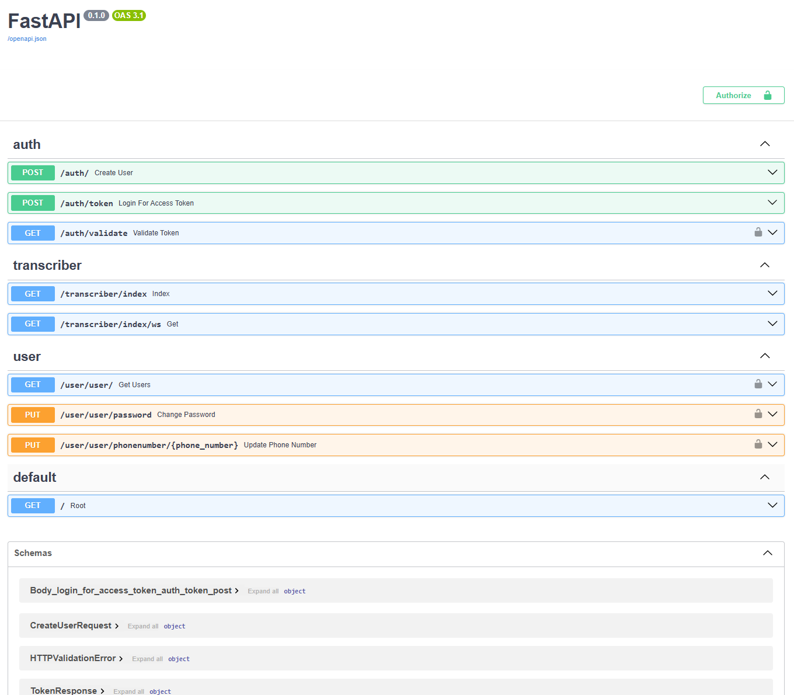
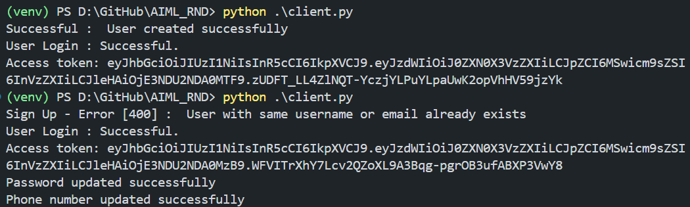

## Start Server
`uvicorn main:app --reload`  

### Start a client
In a separate terminal  
`python client.py`

<b>Steps :</b>  
1. Install the requirements into a virtual env  
Create Env : `py -3.11 -m venv venv`  
Activate : `.\venv\Scripts\activate`  
Install Reqs : `pip install -r requirements`   
2. Start Server API  
`uvicorn main:app --reload`   
3. Below is the API Structure at : http://127.0.0.1:8000/docs#/  
   
4. Run Client Script  
In separate terminal run : `python client.py`  
5. The Code can :  
a) Register / SignUp a new user. If the user already exists it skips updating  
  
b) It updates a SQL DB at the backend. Use the below code or check Notebook : `peek_db.ipynb`  
'''
import pandas as pd
import sqlite3
conn = sqlite3.connect("./data/db.sqlite3")
df_users = pd.read_sql_query("SELECT * FROM Users", conn)
df_token = pd.read_sql_query("SELECT * FROM tbl_token", conn)
print(df_token.tokenVal.values[0])
'''
 
c) Additionally corresponding websocket and http endpoint is available in transcriber.py